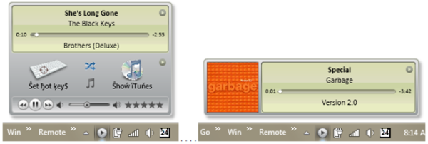

**Project Description**  
A system tray app that adds seamless features to iTunes including automated library maintenance, playlist management, playlist sychronization with MP3 players, lyrics downloads, track and playback control, and global keyboard control.  C#, WPF, MusicBrainz, iTunes APIs, and more!

**From a gracious follower**

_"Thank you for all of your support for this wonderful tool. I love using it to transfer my iTunes music library to my mp3 player. I haven't found anything else that works as well as iTuner!!!" - MM_

**Features**

*   [Automated library maintenance and optimization](http://ituner.codeplex.com/wikipage?title=User Guide&referringTitle=Home&ANCHOR#Librarian)
    *   Remove "dead tracks" - tracks in library without corresponding data files
    *   Remove duplicates - multi-level intelligent processing to identify and archive duplicate tracks
    *   Remove empty directories - delete empty hard-drive directories left over by iTunes' _organize_
    *   Automatically import media files not yet in iTunes Library
    *   Automatically download missing album artwork
*   [Synchronize](http://ituner.codeplex.com/wikipage?title=User Guide&referringTitle=Home&ANCHOR#Synchronize) one or more playlists directly to a selected USB MP3 player
*   [Easy playlist export/import](http://ituner.codeplex.com/wikipage?title=User Guide&referringTitle=Home&ANCHOR#Export)
    *   Export an album, an iTunes playlist, or all tracks by an artist with just a couple of clicks
    *   Convert the iTunes tracks to any supported music format, AAC, AIFF, M4A, MP3, or WAV
    *   Copy these tracks to any location, disk, USB, along with a playlist index file such as M3U, PLS, WPL, and ZPL
    *   Import a playlist index file to create a new library playlist and optionally import new media files
*   [Global hot key control](http://ituner.codeplex.com/wikipage?title=User Guide&referringTitle=Home&ANCHOR#HotKeys) of iTunes playback with customizations
*   [Automatic lyric discovery](http://ituner.codeplex.com/wikipage?title=User Guide&referringTitle=Home&ANCHOR#Lyrics) using multiple online providers
*   Quick access to view lyrics of current track
*   System Tray icon showing the current player state: play or pause
*   Notify popup showing current track information, title, artist, album, and album artwork
*   Detailed track information with quick link to storage folder on disk
*   Indication of source location, standard music library, movies, TV shows, podcasts, radio
*   Basic playback controls including, next/prev track, play/pause, volume, position, rating, and shuffle
*   Basic track information editor to customize title, artist, and album

**And**

*   [Crystal ball](http://ituner.codeplex.com/releases/view/87258 "Crystal ball to the crystal ball")...
*   [See us on Facebook](http://www.facebook.com/#!/pages/ITuner-News/132318033496418) and please click the Like button!
*   Translators Wanted! – _If you’d like to help translate this project, please see the [translation page](http://ituner.codeplex.com/wikipage?title=Translation&referringTitle=Documentation)._

**Please Support**  
I do this as a hobby so it is with great humility and
appreciation that I humbly request that you consider a small donation to support the development
of my projects. In exchange, I pledge to continue listening with an open mind and to respond to your
questions and tips in a timely manner.

Please consider a sponsorship or one-time donation, click here:

   

**Why?**  
While iTunes is a very intuitive and feature-rich application, as a developer I normally have many windows open at the same time and screen real-estate is at a premium. Bringing iTunes to the foreground is often intrusive and overly cumbersome for clicking a single button or reading a quick track title. Running in Mini Player mode or minimizing iTunes to the Windows taskbar as a small toolbar are both great and provide handy playback controls. But neither is perfect. After using iTunes for a little while, I started realizing what I really wanted... iTuner is small, light-weight, intuitive, and its automated features make it more powerful than any iTunes add-on available.  

**Some Future Possibilities**

*   Startup with iTunes, as an iTunes plug-in
*   Scheduled iPod/iPhone synchronization
*   Integration with Windows Messenger to show current song
*   Import media files from alternate location

**Media Coverage**

*   [Addictive Tips](http://www.addictivetips.com/windows-tips/ituner-add-playback-control-system-tray-dashboard-to-itunes]) _13 Feb 2010_
*   [Addictive Tips "Must Have!"](http://www.addictivetips.com/windows-tips/ituner-is-now-a-must-have-tool-for-everyone) _25 Mar 2010_
*   [Arturogoga "Perfect Companion"](http://www.arturogoga.com/2010/03/25/ituner-compaia-perfecta-para-itunes) _25 Mar 2010_
*   [Baixaki](http://www.baixaki.com.br/download/ituner.htm "http://www.baixaki.com.br/download/ituner.htm") [_(_](http://www.baixaki.com.br/download/ituner.htm "http://playpcesor.blogspot.com/2010/05/ituner-itunesmp3.html")[_translated_](http://www.microsofttranslator.com/BV.aspx?ref=IE8Activity&a=http%3A%2F%2Fwww.baixaki.com.br%2Fdownload%2Fituner.htm "http://www.microsofttranslator.com/BV.aspx?ref=IE8Activity&a=http%3A%2F%2Fwww.baixaki.com.br%2Fdownload%2Fituner.htm")_)_ _30 Apr 2012_
*   [blogspot by playpcesor](http://playpcesor.blogspot.com/2010/05/ituner-itunesmp3.html "http://playpcesor.blogspot.com/2010/05/ituner-itunesmp3.html") _(_[_translated_](http://www.microsofttranslator.com/BV.aspx?ref=IE8Activity&a=http%3A%2F%2Fplaypcesor.blogspot.com%2F2010%2F05%2Fituner-itunesmp3.html "http://www.microsofttranslator.com/BV.aspx?ref=IE8Activity&a=http%3A%2F%2Fplaypcesor.blogspot.com%2F2010%2F05%2Fituner-itunesmp3.html")_)_ _16 May 2010_
*   [Computer! Totaal](http://computertotaal.nl/article/21480/ituner-1-2-37.html) _([translated](http://www.microsofttranslator.com/bv.aspx?from=nl&to=en&a=http%3A%2F%2Fcomputertotaal.nl%2Farticle%2F21480%2Fituner-1-2-37.html))_ _16 Sep 2010_
*   [Computer! Totaal](http://computertotaal.nl/article/21838/gratis-toptools-voor-itunes.html) _(_[_translated_](http://www.microsofttranslator.com/bv.aspx?from=nl&to=en&a=http%3A%2F%2Fcomputertotaal.nl%2Farticle%2F21838%2Fgratis-toptools-voor-itunes.html)_)_ _30 Nov 2010_
*   [descargas.net](http://www.descargas.net/ituner-expande-las-opciones-de-itunes "descargas.net") _(__[translated](http://www.microsofttranslator.com/BV.aspx?ref=IE8Activity&a=http%3A%2F%2Fwww.descargas.net%2Fituner-expande-las-opciones-de-itunes "translated")__) 18 May 2012_
*   [ghacks.net](http://www.ghacks.net/2010/04/27/ituner-advanced-itunes-mini-player) _27 Apr 2010_
*   [Instant Fundas "Honey I shrunk iTunes!"](http://www.instantfundas.com/2010/02/ituner-honey-i-shrunk-itunes.html) _11 Feb 2010_
*   [iPhone Ticker](http://www.iphone-ticker.de/2010/04/28/windows-download-ituner-praktischer-werkzeugkasten-fur-itunes-nutzer) _28 Apr 2010_
*   [JeTelecharge](http://www.jetelecharge.com/Multimedia/5116.php) _2010_
*   [Kim Komando](http://www.komando.com/downloads/category.aspx?id=13148)_ 24 Aug _2012_  
    _
*   [Softonic Editor"'s Choice"](http://ituner.en.softonic.com) _29 Apr 2010_
*   [Maximum PC "Amazing"](http://www.maximumpc.com/article/features/freeware_files_five_amazing_addons_common_apps_841) _29 Mar 2010_
*   [Maximum PC "Rocks"](http://www.maximumpc.com/article/features/15_free_ways_improve_itunes-311) _14 Dec 2010_
*   [Revision3 Video Review!](http://revision3.com/tzdaily/2010-05-27ituner) _25 May 2010_
*   [Worthy Tips](http://www.worthytips.com/automatic-discover-lyrics-itunes) _2 Mar 2010_

  

_Copyright (c) 2010-2012 Steven M. Cohn. All rights reserved._  

_iTunes is a trademark of Apple Inc._
